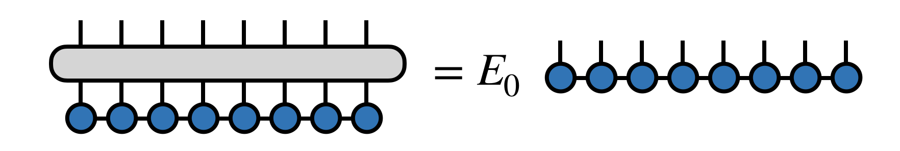

# DMRG simulation of bosonic quantum gases confined in 1D lattice

    

## Authors

* [**Rinaldi Luca**](https://github.com/RinaldiLuca) (University of Padua)
* [**Borella Lorenzo**](https://github.com/lorenzobore) (University of Padua)

## Abstract
The density matrix renormalizaton group (DMRG) is an adaptive algorithm for optimizing a matrix product state (MPS) tensor network, such that after optimization, the MPS is approximately the dominant eigenvector of a large matrix.

This work consist of reproducing the results of [**this paper**](https://arxiv.org/abs/1304.3012) with an ad-hoc written DMRG algorithm, starting from the MPS class of [**TeNPy**](https://tenpy.readthedocs.io).

## Content
* [**`modules`**](https://github.com/RinaldiLuca/quantum-info-project/tree/master/modules) folder is the python package containing all the classes and functions.
* [**`myDMRG_final`**](https://github.com/RinaldiLuca/quantum-info-project/blob/master/myDMRG_final.ipynb) is the python notebook that reproduces the results obtained in the paper.

The final presentation of this project can be found [**here**](https://github.com/RinaldiLuca/quantum-info-project/blob/main/slides.pdf)

## References

* [**Tensor Diagram Notation**](https://tensornetwork.org/diagrams/)
* [**DMRG - Density Matrix Renormalization Group**](https://tensornetwork.org/mps/algorithms/dmrg/)
* [**TeNPy library**](https://tenpy.readthedocs.io)
* [**Cluster Luttinger Liquids of Rydberg-dressed Atoms in Optical Lattices**](https://arxiv.org/abs/1304.3012)
